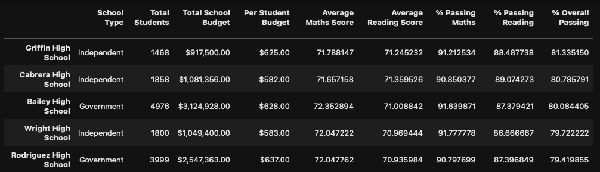

# Module 4 Homework Assignment: Pandas-Challenge Report

## Introduction
You are the new Chief Data Scientist for your local government area. In this capacity, you'll be helping the school board and mayor make strategic decisions regarding future school budgets and priorities.
As a first task, you've been asked to analyse the area-wide standardised test results. You'll be given access to every student's maths and reading scores, as well as various information on the schools they attend. Your task is to aggregate the data to showcase obvious trends in school performance.

## Summary of Results
The following table provides a high level summary of the all the schools  in the local area with student results. This table indicates that in the local area, reading and maths scores are quite similar to one another at around 70. The percentage of students that pass maths are similar to that of reading, which is 85%. Just under three quarters (73%) of students are passing both maths and reading.

The following figure tablutes a school-by-school summary along with average marks and pass rates for reading and maths. Drawing conclusions directly from this table is not so easy so further analysis is required.

The top and bottom 5 performing schools is posted below. Intersestingly, 4 out of the 5 top performing schools are independent schools. 

The inverse is true for the bottom 5 schools where 4/5 of these schools are Government type.

The average grades by year level for maths are illustrated below. In general the grades across the year levels for the schools are quite consistent with each other with a standard deviation less than 1. The school with the largest variation in marks across the year groups is Holden High School.

The average grades by year level for reading are illustrated below. In general the grades across the year levels for the schools are quite consistent with each other with a standard deviation less than 1. There is slightly more spread across the year levels in average grades in general for reading compared to maths. The school with the largest variation in marks across the year groups is Griffin High School.

Some key findings from this summary start to become evident when we start grouping some of the results. When the Spending Ranges per student are binned into 4 groups as shown below, it is clear that there is a positive correlation with increased spending with higher marks and pass-rates. This trend may need to be verified with different or consistent bin intervals.

The dataset is then split into 3 bins of number of students per school. There appears to be a trend with increased success in reading and maths scores with a reduced number of students per school. This may need to be further tested and verified with different bin ranges.

When the dataset is binned into either Government or Independent school types, the Independent schools on average score better than the Government schools. This is consistent with the above observations of the top and bottom 5 performing schools.

